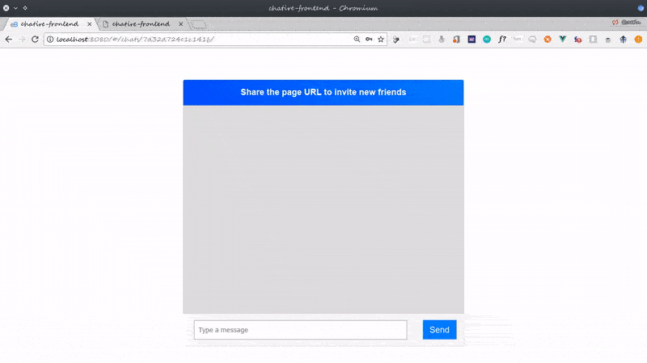

<p align="center">
  
</p>

# chatire

Real time Chat application built with Vue, Django, RabbitMQ and uWSGI WebSockets.



This repo contains the code for my tutorial **[Realtime django: Build a Chat application with Django, RabbitMQ and Vue.js](https://danidee10.github.io/2018/01/01/realtime-django-1.html)**

The tutorial is split into several parts:

- Part 1: [Introduction and Setup](https://danidee10.github.io/2018/01/01/realtime-django-1.html)
- Part 2: [Authentication and User Management](https://danidee10.github.io/2018/01/03/realtime-django-2.html)
- Part 3: [Build an API with django rest framework](https://danidee10.github.io/2018/01/07/realtime-django-3.html)
- Part 4 [Plug the Vue frontend to the django API](https://danidee10.github.io/2018/01/10/realtime-django-4.html)
- Part 5 [uWSGI WebSockets](https://danidee10.github.io/2018/01/13/realtime-django-5.html)
- Part 6 [Extras](https://danidee10.github.io/2018/03/12/real-time-django-6.html)

## Running the code

### Vue

Navigate to the `chatire-frontend directory`:

```bash
cd chatire-frontend
```

Install the dependencies from npm:

``` bash
npm install
```

Run the webpack dev server (starts on localhost:8080):

```bash
npm run dev
```

### Django

To get the Django server running:

Install the requirements from pip

```bash
pip install -r requirements.txt
```

Run django's development server (starts on localhost:8000):

```bash
python manage.py runserver
```

### RabbitMQ

Chatire uses RabbitMQ to bridge the django application and the uWSGI WebSocket server. The installation process varies. Check the [docs](https://www.rabbitmq.com/download.html) on how you can install it for your platform.

### WebSocket server

Chatire uses `uWSGI` as it's websocket server, if you've already installed the requirements from `requirements.txt` if should already be installed.

You can start it with

```bash
uwsgi --http :8081 --gevent 100 --module websocket --gevent-monkey-patch --master
```

This starts uwsgi with 100 gevent (greenlet) threads. You can increase it if you want to.


# Acknowledgements
Thanks to [@inhit](https://github.com/ihtiht) for the Logo!
